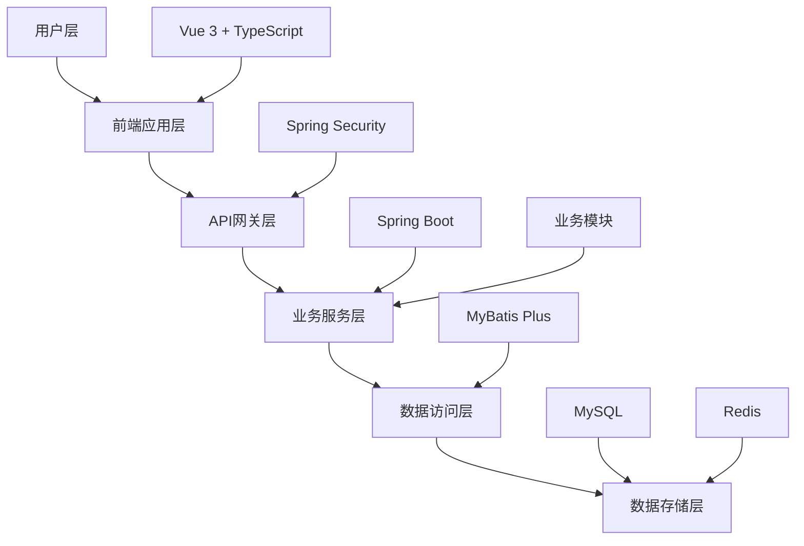

# 🏥 智慧养老院管理系统

<div align="center">


[](https://github.com/PrescottClub/Nursing-home-management-system/stargazers)
[](https://github.com/PrescottClub/Nursing-home-management-system/network)
[](https://github.com/PrescottClub/Nursing-home-management-system/blob/master/LICENSE)

**一站式智慧养老院数字化管理解决方案**

[在线演示](http://demo.gerocomium.com) · [快速开始](#-快速开始) · [功能特性](#-核心特性) · [技术架构](#-技术架构) · [部署指南](#-部署指南)

</div>

---

## 📋 项目简介

智慧养老院管理系统是一套基于 **Spring Boot 3.x + Vue 3 + TypeScript** 构建的现代化养老院综合管理平台。系统采用前后端分离架构，提供营销管理、入住管理、人员管理、服务管理、物资管理、餐饮管理、费用管理等全业务流程数字化解决方案。

> 💡 **项目愿景**：由 [Terence Qin](https://github.com/PrescottClub) 发起并主导开发，致力于通过现代化技术手段，为养老行业提供高效、安全、易用的数字化管理解决方案，让科技真正服务于养老事业。

### 🎯 设计理念

- **以人为本**：围绕老人、家属、员工三大核心用户群体设计
- **数据驱动**：基于大数据分析提供智能决策支持
- **安全可靠**：多层次安全防护，保障数据安全和隐私
- **易用高效**：简洁直观的操作界面，提升工作效率

## ✨ 核心特性

### 🏢 业务管理
- **全流程覆盖**：从营销获客到入住退住的完整业务闭环
- **智能床位**：可视化床位管理，实时状态监控
- **精细化服务**：个性化护理方案，分级服务管理
- **智能排班**：员工排班优化，工作量均衡分配

### 🔐 安全保障
- **权限管控**：基于RBAC的细粒度权限控制
- **数据加密**：敏感数据加密存储，传输安全保障
- **操作审计**：完整的操作日志记录和审计追踪
- **多重认证**：JWT + Redis 双重认证机制

### 📊 数据智能
- **实时监控**：关键业务指标实时监控大屏
- **智能报表**：多维度数据分析和可视化展示
- **预警机制**：异常情况自动预警和通知
- **决策支持**：基于数据的经营决策建议

### 🚀 技术优势
- **高性能**：Redis缓存 + 数据库优化，毫秒级响应
- **高可用**：微服务架构，支持集群部署
- **易扩展**：模块化设计，支持功能快速扩展
- **跨平台**：响应式设计，支持PC、平板、手机多端访问

## 🛠️ 技术架构

### 🔧 后端技术栈
| 技术 | 版本 | 说明 |
|------|------|------|
| Spring Boot | 2.6.1 | 核心框架，提供自动配置和快速开发能力 |
| Spring Security | 5.6.x | 安全框架，实现认证和授权 |
| MyBatis Plus | 3.4.3.4 | ORM框架，简化数据库操作 |
| MySQL | 8.0+ | 关系型数据库，存储业务数据 |
| Redis | 6.0+ | 缓存数据库，提升系统性能 |
| JWT | 0.11.5 | 无状态认证，支持分布式部署 |
| Swagger | 3.0.0 | API文档生成，提升开发效率 |
| Quartz | 2.3.x | 任务调度框架，支持定时任务 |
| EasyExcel | 3.2.1 | Excel处理，支持大数据量导入导出 |
| Druid | 1.2.8 | 数据库连接池，提供监控能力 |

### 🎨 前端技术栈
| 技术 | 版本 | 说明 |
|------|------|------|
| Vue.js | 3.2.13 | 渐进式JavaScript框架 |
| TypeScript | 4.5.5 | 类型安全的JavaScript超集 |
| Element Plus | 2.2.28 | 基于Vue 3的组件库 |
| Vue Router | 4.0+ | 官方路由管理器 |
| Vuex | 4.0+ | 状态管理模式 |
| Axios | 1.2.2 | HTTP客户端库 |
| ECharts | 5.4.1 | 数据可视化图表库 |
| Tailwind CSS | 3.2.7 | 原子化CSS框架 |
| Vite | 4.0+ | 下一代前端构建工具 |
| ESLint + Prettier | - | 代码质量和格式化工具 |

### 🏗️ 系统架构



## 📁 项目结构

```
智慧养老院管理系统/
├── 📂 backend/                          # 后端服务 (Spring Boot)
│   ├── 📂 src/main/java/com/ew/gerocomium/
│   │   ├── 📂 controller/               # 控制器层 - 处理HTTP请求
│   │   ├── 📂 service/                  # 业务逻辑层 - 核心业务处理
│   │   ├── 📂 dao/                      # 数据访问层 - 数据库操作
│   │   ├── 📂 common/                   # 公共组件
│   │   │   ├── 📂 config/               # 配置类
│   │   │   ├── 📂 constant/             # 常量定义
│   │   │   ├── 📂 util/                 # 工具类
│   │   │   └── 📂 exception/            # 异常处理
│   │   └── 📄 GerocomiumApplication.java # 启动类
│   ├── 📂 src/main/resources/
│   │   ├── 📄 application.yml           # 主配置文件
│   │   ├── 📄 application-dev.yml       # 开发环境配置
│   │   └── 📂 mapper/                   # MyBatis映射文件
│   └── 📄 pom.xml                       # Maven依赖配置
├── 📂 frontend/                         # 前端应用 (Vue 3)
│   ├── 📂 src/
│   │   ├── 📂 views/                    # 页面组件
│   │   │   ├── 📂 home/                 # 🏠 首页概览
│   │   │   ├── 📂 sale/                 # 📈 营销管理
│   │   │   ├── 📂 live/                 # 🏠 入住管理
│   │   │   ├── 📂 people/               # 👥 人员管理
│   │   │   ├── 📂 serve/                # 🛎️ 服务管理
│   │   │   ├── 📂 resource/             # 📦 物资管理
│   │   │   ├── 📂 diet/                 # 🍽️ 餐饮管理
│   │   │   ├── 📂 charge/               # 💰 费用管理
│   │   │   └── 📂 base/                 # ⚙️ 基础配置
│   │   ├── 📂 components/               # 公共组件
│   │   ├── 📂 apis/                     # API接口定义
│   │   ├── 📂 store/                    # Vuex状态管理
│   │   ├── 📂 router/                   # 路由配置
│   │   ├── 📂 utils/                    # 工具函数
│   │   └── 📂 assets/                   # 静态资源
│   ├── 📄 package.json                  # 依赖配置
│   ├── 📄 vite.config.ts               # Vite构建配置
│   └── 📄 tsconfig.json                # TypeScript配置
├── 📂 database/                         # 数据库相关
│   ├── 📄 db_gerocomium.sql            # 数据库初始化脚本
│   └── 📄 README.md                     # 数据库说明文档
├── 📂 docs/                             # 项目文档
│   ├── 📄 API.md                        # API接口文档
│   ├── 📄 DEPLOY.md                     # 部署指南
│   └── 🖼️ logo.png                      # 项目Logo
├── 📄 README.md                         # 项目说明文档
├── 📄 LICENSE                           # 开源协议
└── 📄 CONTRIBUTING.md                   # 贡献指南
```

## 🎯 功能模块

### 📈 营销管理模块
<details>
<summary>点击展开详细功能</summary>

- **咨询管理**：客户咨询记录、跟进状态、转化分析
- **意向客户**：潜在客户信息管理、标签分类、营销漏斗
- **预定管理**：床位预定、确认流程、预定转化

**核心价值**：提升营销效率，优化客户转化流程
</details>

### 🏠 入住管理模块
<details>
<summary>点击展开详细功能</summary>

- **床位全景**：可视化床位状态、实时监控、智能分配
- **入住签约**：合同管理、电子签名、档案建立
- **外出登记**：外出申请、审批流程、安全管控
- **来访登记**：访客管理、身份验证、访问记录
- **事故登记**：安全事故记录、处理流程、责任追踪
- **退住申请**：退住流程、费用结算、档案归档

**核心价值**：规范入住流程，保障老人安全
</details>

### 👥 人员管理模块
<details>
<summary>点击展开详细功能</summary>

- **长者档案**：基本信息、健康档案、护理记录、家属联系
- **员工管理**：员工档案、排班管理、绩效考核、培训记录
- **活动管理**：活动策划、参与统计、效果评估

**核心价值**：精细化人员管理，提升服务质量
</details>

### 🛎️ 服务管理模块
<details>
<summary>点击展开详细功能</summary>

- **服务项目**：护理项目配置、服务标准、质量监控
- **护理等级**：护理级别定义、评估标准、动态调整
- **服务预定**：个性化服务预约、资源调度、服务跟踪

**核心价值**：标准化服务流程，提升护理质量
</details>

### 📦 物资管理模块
<details>
<summary>点击展开详细功能</summary>

- **物资信息**：物资档案、分类管理、供应商信息
- **仓库设置**：仓库配置、库位管理、权限控制
- **入库管理**：采购入库、质检流程、成本核算
- **出库管理**：领用申请、审批流程、使用跟踪
- **库存查询**：实时库存、预警提醒、统计分析

**核心价值**：优化库存管理，降低运营成本
</details>

### 🍽️ 餐饮管理模块
<details>
<summary>点击展开详细功能</summary>

- **菜品管理**：菜品信息、营养配置、成本核算
- **餐饮套餐**：套餐设计、营养搭配、价格管理
- **点餐管理**：订餐流程、配送跟踪、满意度调查

**核心价值**：保障营养健康，提升用餐体验
</details>

### 💰 费用管理模块
<details>
<summary>点击展开详细功能</summary>

- **预存充值**：账户充值、支付方式、资金安全
- **消费记录**：消费明细、账单生成、对账管理
- **退住费用审核**：退费流程、审核机制、财务核算

**核心价值**：透明费用管理，保障资金安全
</details>

### ⚙️ 基础数据配置
<details>
<summary>点击展开详细功能</summary>

- **营销配置**：来源渠道、客户标签、营销策略
- **入住配置**：房间类型、楼栋管理、床位设置
- **活动配置**：活动类型、场地管理、资源配置

**核心价值**：灵活配置管理，适应业务变化
</details>

## 🚀 快速开始

### 📋 环境要求

| 环境 | 版本要求 | 说明 |
|------|----------|------|
| JDK | 1.8+ | 推荐使用 JDK 11 |
| Node.js | 16+ | 推荐使用 LTS 版本 |
| MySQL | 8.0+ | 支持 5.7+ |
| Redis | 6.0+ | 用于缓存和会话存储 |
| Maven | 3.6+ | 后端依赖管理 |

### 🗄️ 数据库初始化

```bash
# 1. 创建数据库
mysql -u root -p
CREATE DATABASE db_gerocomium CHARACTER SET utf8mb4 COLLATE utf8mb4_unicode_ci;

# 2. 导入数据库脚本
mysql -u root -p db_gerocomium < database/db_gerocomium.sql

# 3. 验证数据导入
USE db_gerocomium;
SHOW TABLES;
```

### 🔧 后端启动

```bash
# 进入后端目录
cd backend

# 清理并安装依赖
mvn clean install -DskipTests

# 修改配置文件
# 编辑 src/main/resources/application-dev.yml
# 配置数据库连接信息和Redis连接信息

# 启动服务
mvn spring-boot:run

# 或者使用IDE启动 GerocomiumApplication.java
```

### 🎨 前端启动

```bash
# 进入前端目录
cd frontend

# 安装依赖 (推荐使用 pnpm)
npm install
# 或者
yarn install
# 或者
pnpm install

# 启动开发服务器
npm run serve
# 或者
yarn serve
```

### 🌐 访问系统

| 服务 | 地址 | 说明 |
|------|------|------|
| 前端应用 | http://localhost:8080 | Vue 3 前端界面 |
| 后端API | http://localhost:9001 | Spring Boot 后端服务 |
| API文档 | http://localhost:9001/doc.html | Swagger API 文档 |
| 数据库监控 | http://localhost:9001/druid | Druid 连接池监控 |

### 👤 默认账号

| 角色 | 用户名 | 密码 | 权限 |
|------|--------|------|------|
| 超级管理员 | admin | 123456 | 全部权限 |
| 普通管理员 | manager | 123456 | 部分权限 |

## ⚙️ 配置说明

### 🔧 后端配置

编辑 `backend/src/main/resources/application-dev.yml`：

```yaml
# 数据库配置
spring:
  datasource:
    druid:
      url: jdbc:mysql://127.0.0.1:3306/db_gerocomium?useSSL=false&useUnicode=true&characterEncoding=utf-8&allowMultiQueries=true&serverTimezone=Asia/Shanghai
      username: root
      password: your_password
      driver-class-name: com.mysql.cj.jdbc.Driver

# Redis配置
  redis:
    host: 127.0.0.1
    port: 6379
    password: your_redis_password  # 如果没有密码可以注释掉
    database: 1
    timeout: 10000

# 文件上传配置
filesave:
  windows: D:\gerocomium-files  # Windows文件存储路径
  linux: /opt/gerocomium-files  # Linux文件存储路径
  upload-head: http://127.0.0.1:9001
```

### 🎨 前端配置

编辑环境配置文件：

**开发环境** (`frontend/env.development`)：
```env
VUE_APP_BASE_URL=http://127.0.0.1:9001
VUE_APP_BASE_NAME=gerocomium-dev
```

**生产环境** (`frontend/env.production`)：
```env
VUE_APP_BASE_URL=https://your-production-domain.com
VUE_APP_BASE_NAME=gerocomium-prod
```

## 🔧 开发指南

### 📏 代码规范

#### 后端规范
- 遵循阿里巴巴Java开发手册
- 使用Lombok简化代码
- 统一异常处理和返回格式
- 完善的注释和文档

#### 前端规范
- 使用ESLint + Prettier进行代码格式化
- 组件采用Composition API
- TypeScript类型安全
- 统一的API接口调用

### 🔌 API接口规范

#### 请求格式
```json
{
  "code": 200,
  "msg": "success",
  "data": {}
}
```

#### 错误处理
```json
{
  "code": 500,
  "msg": "error message",
  "data": null
}
```

### 🗃️ 数据库规范

- **逻辑删除**：统一使用 `del_flag` 字段 (Y/N)
- **时间字段**：`create_time`, `update_time`
- **操作人字段**：`create_id`, `update_id`
- **主键策略**：自增ID (`AUTO_INCREMENT`)
- **字符集**：UTF8MB4，支持emoji表情

## 🚀 部署指南

### 🐳 Docker部署 (推荐)

```bash
# 1. 克隆项目
git clone https://github.com/PrescottClub/Nursing-home-management-system.git
cd Nursing-home-management-system

# 2. 构建并启动服务
docker-compose up -d

# 3. 查看服务状态
docker-compose ps
```

### 🖥️ 传统部署

#### 后端部署
```bash
# 1. 打包项目
cd backend
mvn clean package -DskipTests

# 2. 运行jar包
java -jar target/gerocomium-0.0.1-SNAPSHOT.jar --spring.profiles.active=prod
```

#### 前端部署
```bash
# 1. 构建项目
cd frontend
npm run build

# 2. 部署到Nginx
cp -r dist/* /var/www/html/
```

## 🤝 参与贡献

我们欢迎任何形式的贡献！请阅读 [CONTRIBUTING.md](CONTRIBUTING.md) 了解如何参与项目开发。

### 🔄 开发流程
1. **Fork** 本仓库
2. **创建** 特性分支 (`git checkout -b feature/AmazingFeature`)
3. **提交** 你的修改 (`git commit -m 'Add some AmazingFeature'`)
4. **推送** 到分支 (`git push origin feature/AmazingFeature`)
5. **提交** Pull Request

### 🐛 问题反馈
- 发现Bug？请提交 [Issue](https://github.com/PrescottClub/Nursing-home-management-system/issues)
- 有建议？欢迎在 [Discussions](https://github.com/PrescottClub/Nursing-home-management-system/discussions) 中讨论

## 📄 开源协议

本项目基于 [MIT License](LICENSE) 开源协议，详情请查看 [LICENSE](LICENSE) 文件。

## 🙏 致谢

- 感谢项目创始人 **Terence Qin** 的技术愿景和持续投入
- 感谢所有参与本项目的贡献者和支持者
- 特别感谢开源社区提供的优秀工具和库
- 感谢现代化养老院管理实践的启发和指导
- 感谢每一位关注养老事业数字化发展的朋友

## 📞 联系我们

- **项目创建者**：[Terence Qin](https://github.com/PrescottClub)
- **技术负责人**：[@PrescottClub](https://github.com/PrescottClub)
- **邮箱**：jger8276@gmail.com
- **技术支持**：欢迎提交 [Issues](https://github.com/PrescottClub/Nursing-home-management-system/issues) 或 [Discussions](https://github.com/PrescottClub/Nursing-home-management-system/discussions)

---

<div align="center">

### ⭐ 如果这个项目对你有帮助，请给我们一个Star！

**让科技赋能养老，让每一位老人都能享受更好的生活！** 🌟

[](https://star-history.com/#PrescottClub/Nursing-home-management-system&Date)

</div>

## 🔗 相关链接

| 技术文档 | 链接 |
|----------|------|
| Spring Boot | [官方文档](https://docs.spring.io/spring-boot/docs/current/reference/htmlsingle/) |
| Vue.js | [官方文档](https://cn.vuejs.org/guide/) |
| Element Plus | [组件文档](https://element-plus.org/zh-CN/) |
| MyBatis Plus | [官方文档](https://mybatis.plus/) |
| Redis | [官方文档](https://redis.io/documentation) |
| MySQL | [官方文档](https://dev.mysql.com/doc/) |